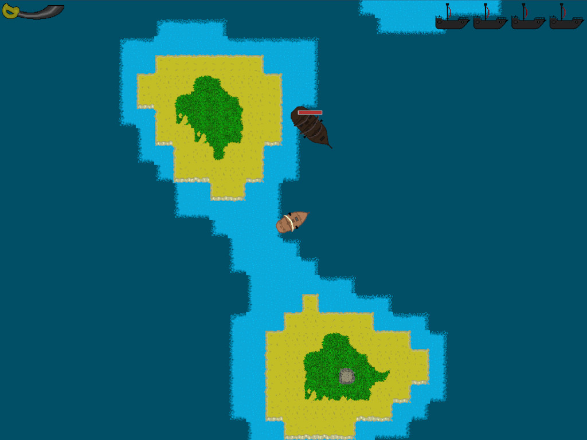

# Butin & Baston

📖 [Manuel d'utilisation](docs/notice.md)

## Contexte

Ce jeu a été créé lors d'une formation avec pour contraintes :

- Utiliser Lua et [LÖVE](https://www.love2d.org/)
- Pas de bibliothèque externe
- Jeu 2D en vue du dessus
- Utiliser des machines à états non linéaires
- Utiliser la trigonométrie pour les rotations et calcul d'angles

## Conception

Avant de commencer, j'ai réalisé un [Game Design Document](docs/gdd.md) (inspiré par la méthodologie de [Tim Cain](https://www.youtube.com/@CainOnGames)).

En l'état actuel, le jeu n'intègre pas toutes les fonctionnalités décrites dans ce document.

[D'autres idées](docs/backlog.md) ont d'ailleurs émergées pendant la phase de développement.

## Développement

J'ai réalisé un [document technique](docs/tech.md) qui détaille l'architecture de ce projet.

## Assets

Les images ont été réalisées par [Naroslav](https://github.com/FSic).

Les polices, musiques et sons utilisés sont libres de droit.
