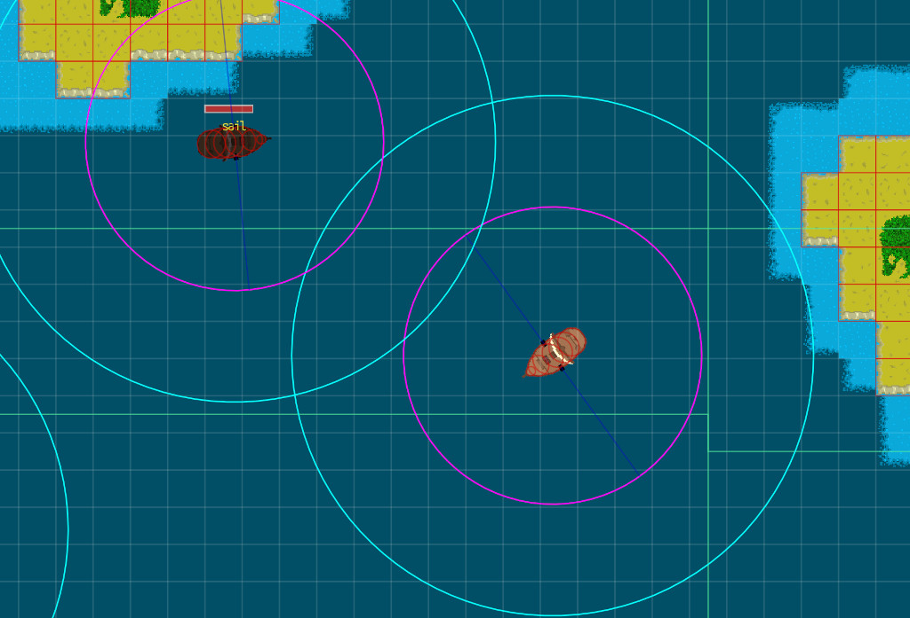

# Documentation technique

## Structure des fichiers

- `assets/` : les différentes ressources du jeu (images, polices, audio)
- `toolbox/` : utilitaires réutilisables pour d'autres projets
- `gameplay/` : tout ce qui est propre à l'écran de jeu

## Gestion des entités

Dans ce jeu, une entité correspond à tout objet visuel (une image et une position).

Le module `EntityManager` se charge de les répertorier, de les créer et de les supprimer.

## Découplage du code

Pour éviter d'avoir des modules trop couplés, j'ai utilisé les techniques suivantes :

### 1. Managers

Ces modules permettent de regrouper les données liées, comme dans `CameraManager` où on peut ajuster toutes les caméras, alors que si elles étaient définies dans des fichiers séparés et qu'on ait besoin de modifier toutes les résolutions, on doive le faire dans chacun.

### 2. Service Locator

Les Managers sont des modules centraux utilisés un peu partout. Pour éviter d'avoir à les importer, on fait appel au module `Services` pour qu'il nous donne accès au module souhaité.

### 3. Système d'évènements

J'ai repris le système d'évènements de C# en l'adaptant pour Lua. Ça permet qu'un module dise par exemple "un bateau vient de couler" et qu'un autre qui l'écoute mette à jour l'interface pour représenter cet évènement.

## Machines à états

Le jeu comporte plusieurs machines à états comme :
- la gestion des scènes : menu et gameplay
- les pages du menu : nouvelle partie, commandes, paramètres, etc.

La plus complexe est celle qui gère le comportement des ennemis :

_Note : Pour afficher le mode debug, appuyez sur F3. Vous pouvez zoomer et dézoomer._

1. Lorsqu'on est trop loin du joueur (plus de 30 cases), on s'arrête.
2. Lorsqu'on est dans un rayon de cases autour du joueur, on avance tout en évitant les collisions.
3. Lorsqu'on a le joueur dans notre champ de vision (cercle cyan):
  3.1. si notre vie est en dessous de 25%, on le fuit,
  3.2. sinon on le poursuit.
4. Si on est à portée de tir du joueur (cercle fushia), on tourne pour que le canon le plus proche de lui puisse lui tirer dessus.
5. Si un canon est bien orienté (trait bleu marine) vers le joueur, on l'attaque.
